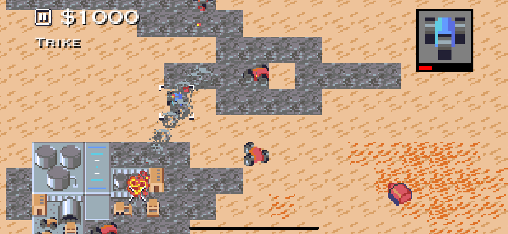

# Swune

Swune is a partial reimplementation of the [Dune II](https://en.wikipedia.org/wiki/Dune_II) RTS game using Swift and UIKit.

## How to Install

To play Swune, just download the Swune Xcode project and run it. It has no dependencies

Swune is designed for iOS, but also runs on macOS in the MacCatalyst environment.

## How to Play

Swune is designed for touch controls but can be played comfortably with a mouse.

The game is currently just a single level demo. You begin at the top of the map with a Construction Yard and a handful of units.

The aim of the mission is to destroy all enemy buildings and gather 1100 units of Spice. To do this you will need to:

* Build a Spice Refinery (select the Construction Yard and then select the avatar in the top-right for build options)
* Build an army of units to overwhelm the enemy (being careful to retain at least 1100 credits in the bank)
* Locate the enemy base and destroy all buildings (destroying enemy units is optional)

## How it Works

The Swune codebase is loosely based on my earlier [Swiftenstein](https://github.com/nicklockwood/Swiftenstein) project, and the spinoff [Retro Rampage](https://github.com/nicklockwood/RetroRampage) game development tutorial. It shares some code with the latter, such as the pathfinding routines.

While it may seem like an FPS and an RTS have little in common (besides having both enjoyed a heyday in the mid-late 1990s) the engines are actually very similar due to both sharing a tile-based 2D map and sprites.

In short, the game works by using a timer to repeatedly update the game logic and then redraw the screen. Drawing is done entirely using UIKit, which is more than powerful enough to simulate a 16-bit era 2D game.

## Credits

Swune is entirely the work of Nick Lockwood, including all graphics and code. The game mechanics are inspired by [UnDUNE II](https://liquidream.itch.io/undune2) by Paul Nicholas, which is itself based on the original Dune II: Battle for Arrakis by Westwood Studios.
